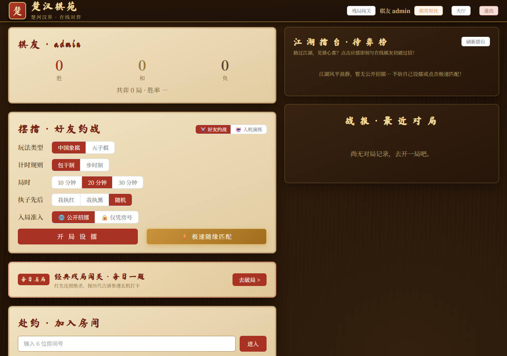
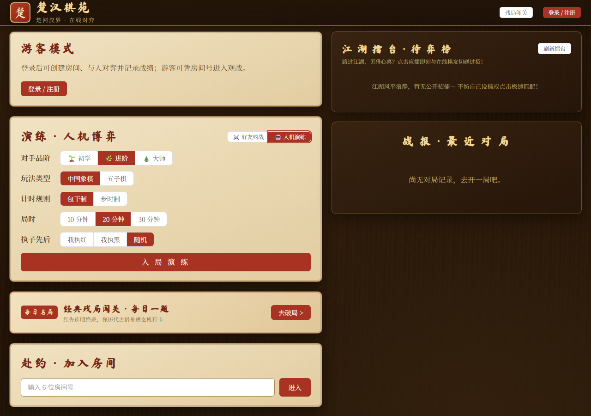
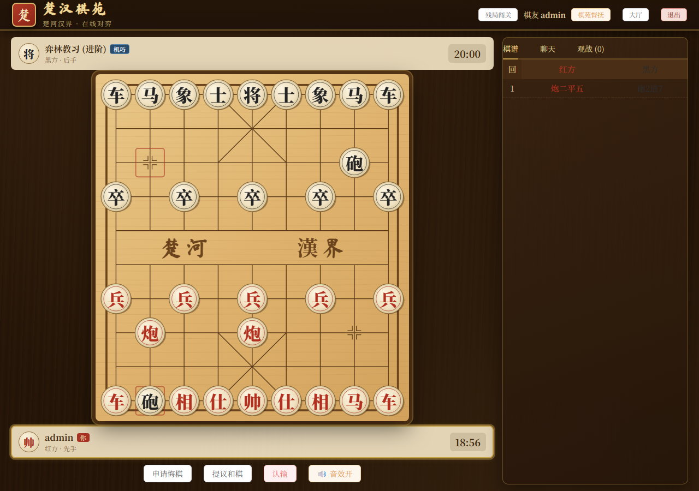
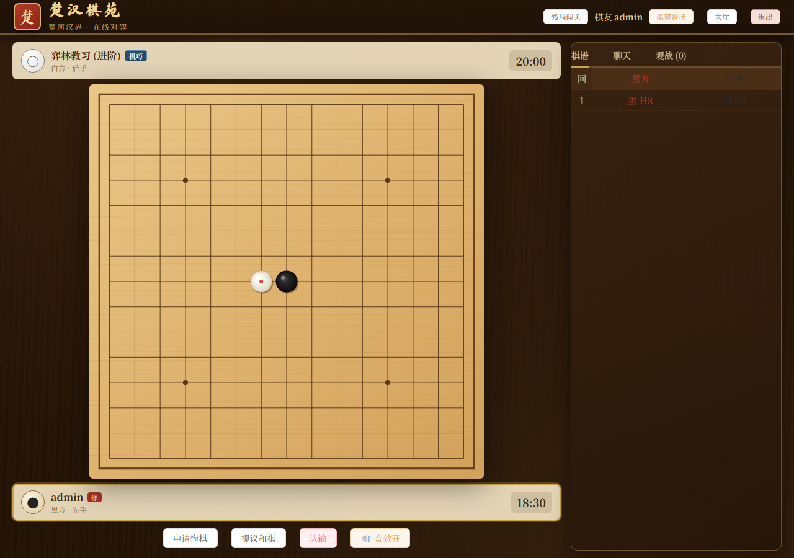
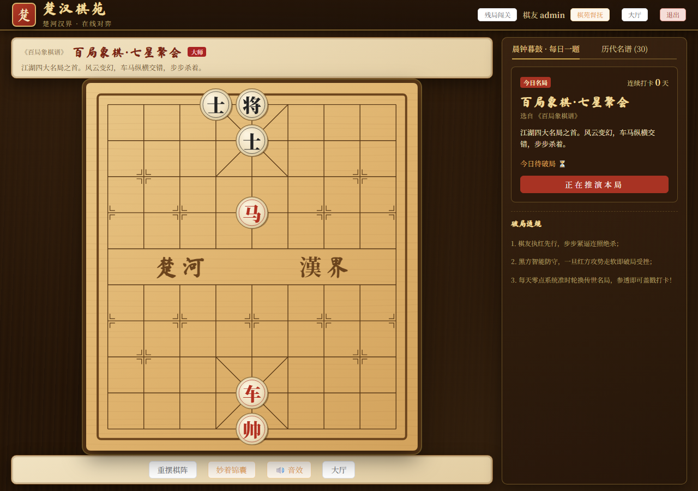
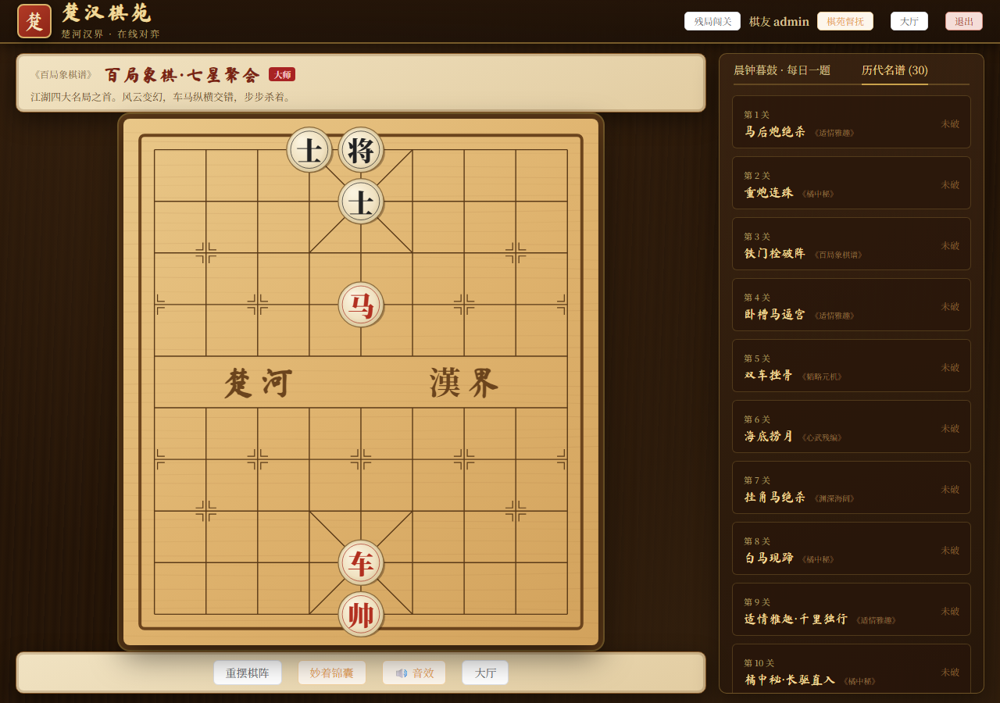
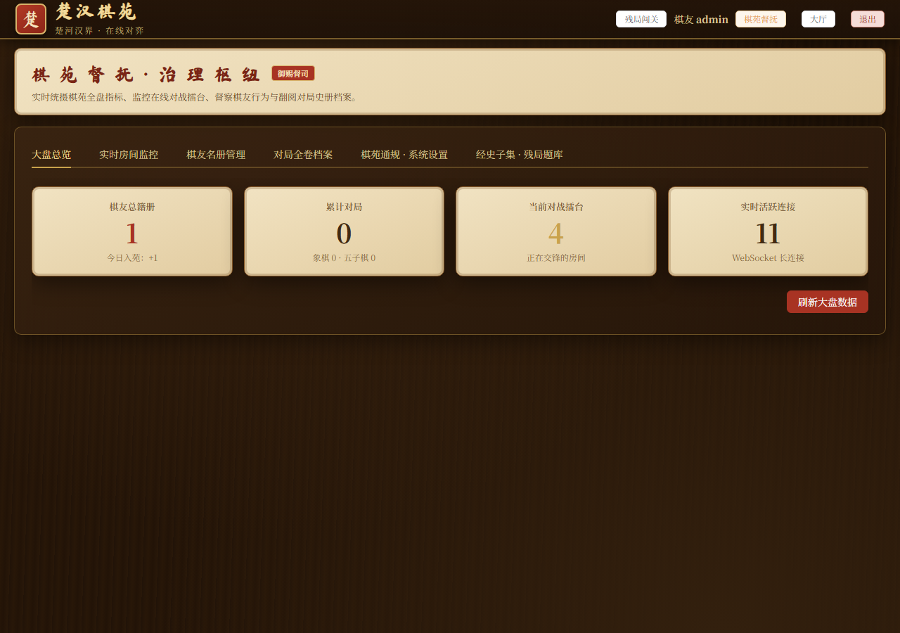
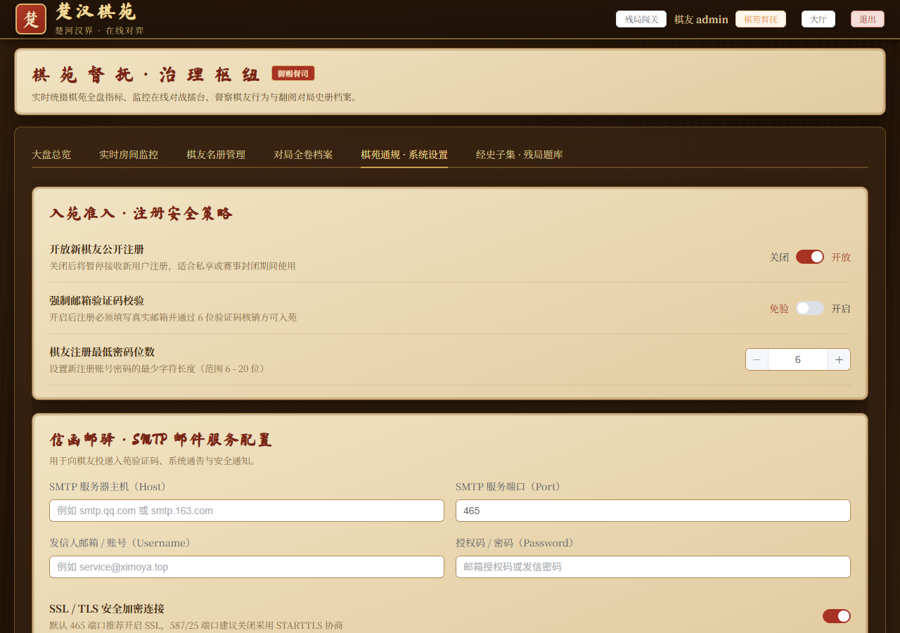

# 楚汉棋苑 (Chu-Han Chess Court)

> 基于 Go 与 Vue 3 构建的自包含传统棋艺在线对弈系统。前端静态资产与纯 Go SQLite 数据库引擎全量融入单一二进制文件，无 CGO 依赖，开箱即用。

<p align="center">
  
  
  
  
  
  
</p>

---

## 目录

- [设计哲学与系统概览](#设计哲学与系统概览)
- [界面鉴赏](#界面鉴赏)
- [功能与技术矩阵](#功能与技术矩阵)
- [快速开始](#快速开始)
- [从源码构建](#从源码构建)
- [生产环境部署](#生产环境部署)
- [工程架构与目录规范](#工程架构与目录规范)
- [开源协议](#开源协议)

---

## 设计哲学与系统概览

楚汉棋苑旨在提供一套高保真、纯净、无任何外部运行时负担的在线棋类博弈系统。项目聚焦于三大设计原则：

1. **单文件自包含交付**：借助 Go 1.16+ 的 `//go:embed` 技术与纯 Go 实现的 `modernc.org/sqlite`，将前端编译产物与数据存储完全内嵌至单一可执行文件，彻底摆脱传统 Web 部署对 Node.js 生产环境、Nginx 反向代理、外部数据库与 GCC 编译工具链的依赖。
2. **纯粹原生的交互与音效**：不引入臃肿的外部音频素材库与物理引擎，依靠 Web Audio API 的振荡器与频段滤波器在毫秒级实时合成实木物理敲击波形；棋盘基于 Canvas 渲染，并在多端视口下施行横纵双向约束，确保全屏内嵌无滚动条。
3. **分层清晰的领域驱动架构**：规则引擎、房间协调中枢、轻量博弈推演、数据持久化与接口鉴权严格解耦，具备高度的可扩展性与可维护性。

---

## 界面鉴赏

### 对弈大厅与人机演练

| 对弈大厅（公共擂台与好友约战） | 人机演练（三大难度品阶切换） |
| :---: | :---: |
|  |  |

### 棋盘核心交锋实景

| 中国象棋对局室（人机进阶交锋） | 五子棋对局室（黑白博弈实测） |
| :---: | :---: |
|  |  |

### 残局推演与每日打卡

| 晨钟暮鼓 · 每日一题打卡 | 历代古谱三十大关名录 |
| :---: | :---: |
|  |  |

### 管理员后台与系统配置中心

| 棋苑督抚 · 治苑大盘总览 | 棋苑通规 · 邮件与大模型配置 |
| :---: | :---: |
|  |  |

---

## 功能与技术矩阵

| 业务领域 | 核心能力 | 实现机制与技术规格 |
| :--- | :--- | :--- |
| **规则引擎** | 中国象棋正规赛制 | 蹩马腿、塞象眼、九宫限制、将帅不照面严格判定；将军检测、将死/困毙判定、长将长捉判负；自动生成国家标准中文棋谱 |
| | 五子棋黑白对弈 | 15×15 经纬格线布局；横向、纵向、正反对角线四向五连珠即时判胜；落子预瞄与最后一手标记 |
| **博弈推演** | 智能人机对抗 (PvE) | 纯 Go 原生实现 Minimax 算法与 Alpha-Beta 剪枝优化；内置 PST 位置权重评估矩阵；模拟 450ms ~ 900ms 拟真思考延时；支持人机极速悔棋与重开 |
| **古谱闯关** | 经典残局与每日一题 | 预置三十道传世经典古谱（《适情雅趣》《橘中秘》《百局象棋谱》等）；基于日历哈希的每日自动轮换机制；红先连照绝杀推演与黑方智能应手；通关朱砂印章与连胜打卡 |
| **对局分析** | 交互式复盘播放器 | 盘面状态单向快照推演；开局/上步/播放/下步/终局控制台；无级时间轴进度拖拽；走法表格实时高亮与点击任意步盘面跳转；键盘快捷键支持 |
| **感官交互** | 物理拟真对弈音效 | 基于 Web Audio API 实时合成实木叩盘、吃子双木相撞、将军弦鸣与胜利和弦；0 毫秒网络延迟；支持随手静音持久化 |
| **联机中枢** | 房间与匹配调度 | WebSocket 长连接维持心跳与断线 90 秒保护；支持公开招擂与私密约战可见度隔离；大厅实时待弈榜展示；极速随缘匹配秒级撮合算法 |
| **治理管理** | 棋苑督抚后台 | 平台运行指标大盘；全服活跃房间监控、一键督战观局与强制解散；棋友名册分页检索、封禁与改密；全卷对局档案回放；残局题库录入与修缮 |
| **安全准入** | 邮箱验证与系统设置 | 原生 SMTP SSL/TLS 发信引擎；10分钟时效与60秒防刷限流；通用 OpenAI 兼容协议大模型接入、模型列表拉取、连通测试与 Token 消耗用量统计看板 |
| **视口适配** | 横纵双向自适应 | 算法联动计算视口可用高度与宽度，根据棋盘固有长宽比等比缩放；彻底消除垂直滚动条，保障对弈区域一屏沉浸展示 |

---

## 快速开始

程序默认监听端口预设为 **`32555`**（高位独立端口，避免常见开发端口占用冲突）。

### 预编译程序直接运行

#### Windows 平台
直接双击运行 `xiangqi.exe`，或在 PowerShell / CMD 中启动：
```powershell
.\xiangqi.exe
```

#### Linux 平台
赋予执行权限后启动：
```bash
chmod +x xiangqi-linux-amd64
./xiangqi-linux-amd64
```

启动成功后，使用现代浏览器访问：
```text
http://localhost:32555
```

> **管理员账号说明**：
> 系统中第一个注册的用户，或者用户名注册为 `admin` 的账号，程序将自动提权为超级管理员（督抚身份），并在顶栏呈现管理后台入口。

---

## 从源码构建

如需对源码进行二次开发或定制修改，请按照以下流程构建。

### 1. 编译环境要求
- **Go**：1.22.0 或更高版本
- **Node.js**：18.0.0 或更高版本（含 npm）

### 2. 构建前端静态资源
```bash
cd web
npm install
npm run build
cd ..
```
编译产物将输出至 `web/dist`，供 Go 编译时嵌入。

### 3. 编译后端可执行文件

**构建 Windows 目标文件**：
```powershell
go build -o xiangqi.exe .
```

**交叉编译 Linux (amd64) 目标文件**：
```bash
CGO_ENABLED=0 GOOS=linux GOARCH=amd64 go build -o xiangqi-linux-amd64 .
```

### 4. 运行时参数配置
```bash
./xiangqi.exe -addr :32555 -db data/xiangqi.db
```
- `-addr`：HTTP 与 WebSocket 服务监听地址，默认 `:32555`。
- `-db`：SQLite 数据库文件存储路径，默认 `data/xiangqi.db`。

---

## 生产环境部署

在 Linux 服务器环境下，建议通过 `systemd` 将服务托管为后台常驻守护进程。

创建服务描述文件 `/etc/systemd/system/xiangqi.service`：

```ini
[Unit]
Description=Chu-Han Chess Court Online Service
After=network.target

[Service]
Type=simple
User=root
WorkingDirectory=/opt/xiangqi
ExecStart=/opt/xiangqi/xiangqi -addr :32555 -db /opt/xiangqi/data/xiangqi.db
Restart=always
RestartSec=5s

[Install]
WantedBy=multi-user.target
```

加载配置并启动服务：
```bash
sudo systemctl daemon-reload
sudo systemctl enable --now xiangqi
sudo systemctl status xiangqi
```

---

## 工程架构与目录规范

```text
xiangqi/
├── main.go                     # 程序主入口、路由装配、go:embed 资源嵌入与 SPA 回退服务
├── go.mod / go.sum             # Go 模块依赖描述
├── README.md                   # 项目工程化自述文档
├── LICENSE                     # MIT 开源许可证文本
├── .gitignore                  # Git 版本控制忽略清单
├── docs/                       # 项目静态文档资源
│   └── images/                 # 核心功能板块高清截图
├── internal/                   # 后端内部核心业务模块
│   ├── ai/                     # 象棋与五子棋博弈推演引擎（Minimax / Alpha-Beta / PST）
│   ├── api/                    # RESTful 接口层、输入校验与权限过滤器
│   ├── auth/                   # HMAC-SHA256 JWT 签发解析与 bcrypt 密码散列
│   ├── email/                  # 原生 Go SMTP 邮件隧道与验证码生命周期管理
│   ├── game/                   # 中国象棋规则引擎（FEN 解析、着法生成、裁决算法）
│   ├── gomoku/                 # 五子棋规则引擎（15x15 盘面、五连判定、悔棋回溯）
│   ├── hub/                    # WebSocket 房间生命周期协调中枢与信令广播
│   ├── llm/                    # 通用 OpenAI 兼容协议大模型客户端与用量捕获
│   ├── puzzle/                 # 经典残局解谜校验器与防守应手自动推演
│   └── store/                  # SQLite 数据库单写连接管理、自动热迁移与战绩统计
└── web/                        # 前端单页应用 (Vue 3 + Vite)
    ├── index.html              # HTML 入口模板
    ├── vite.config.js          # Vite 构建与本地调试转发配置
    ├── src/
    │   ├── App.vue             # 页面根骨架、顶栏导航与页面切换过渡动效
    │   ├── main.js             # 前端初始化入口
    │   ├── router/             # 路由定义与权限导航守卫
    │   ├── stores/             # Pinia 状态树（用户凭证与角色）
    │   ├── styles/             # 古风红木全局样式表与微动效定义
    │   ├── lib/                # 前端工具库（Web Audio 拟真音效、推演计算、WS 通信）
    │   ├── views/              # 业务页面（Lobby、Room、Replay、Puzzle、Admin、Login）
    │   └── components/         # 核心呈现组件（XqBoard、GomokuBoard、PlayerCard、MoveList、ChatPanel）
```

---

## 开源协议

本项目依据 **[MIT License](LICENSE)** 许可证开放源代码。允许自由用于学习、研发、部署及衍生工程。
